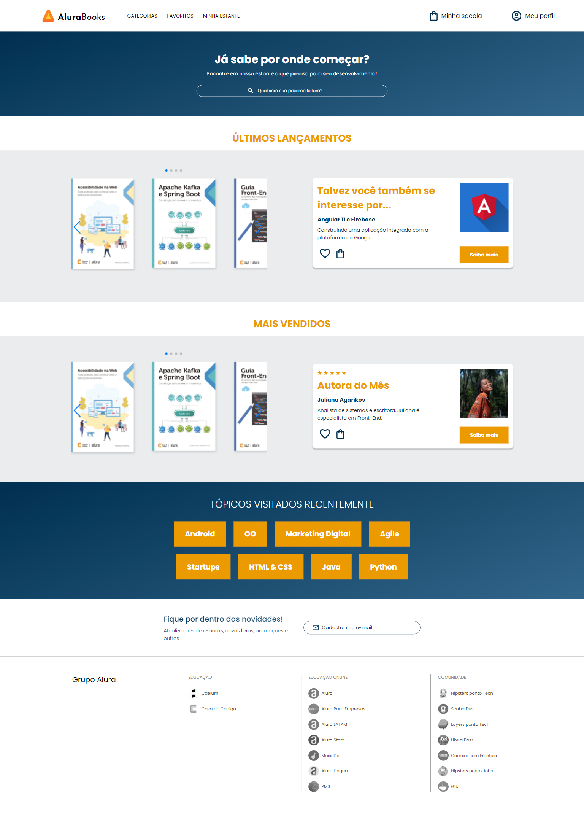
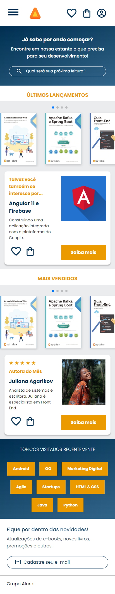

# Página de E-commerce de Livros: Projeto de Desenvolvimento Front-End
Bem-vindo(a) ao meu projeto de página web da AluraBooks! Um projeto de desenvolvimento front-end de uma página de e-commerce de livros e e-books.

Sou Guilherme Nogueira, estudante de desenvolvimento web na plataforma de ensino online [Alura](https://www.alura.com.br/). Esta é uma das páginas web que desenvolvi praticando front-end, com as linguagens HTML e CSS, ao longo do curso de **HTML e CSS: responsividade com mobile-first** - [certificado de conclusão](https://cursos.alura.com.br/certificate/bfaf4c5a-7d8f-4fba-9256-7f1eb79b0620?lang=pt_BR).

## Como Visualizar a Página

Você pode visualizar essa página web aqui: 

## Sobre o Projeto

Se trata de uma página "home" de um e-commerce de livros e e-books, contendo um **cabeçalho**, **banner com barra de pesquisa**, **conteúdo principal** [livros], **seção de tópicos visitados**, **seção de contato** e **rodapé**. Pagína web completamente responsiva em diferentes tamanhos de tela.

---

* No cabeçalho da página temos a logo e o menu de navegação, com os links de redirecionamento. 
* Na seção "banner" temos um título, texto e barra de pesquisa. 
* Na seção principal ficam as subseções de "últimos lançamentos" e "mais vendidos", ambas com um carrossel de produtos [livros] e um card de "outros produtos interessantes" e "autora do mês". 
* Uma seção de "tópicos visitados" com links de redirecionamento para o usuário. 
* Uma seção de contato com formulário de e-mail. 
* Por fim, o rodapé com links para outros produtos e parceiros do Grupo Alura.

---

## Responsividade Total em Dispositivos Móveis

A página se adapta em telas de tablets e smartphones de diferentes tamanhos, como você pode ver nessa imagem de visualização completa da página em um smartphone. Todos os elementos são reorganizados para caber perfeitamente na tela.

## Linguagens Utilizadas

* HTML
* CSS

## Ferramentas Utilizadas

* Visual Studio Code
* Figma

## Detalhes Técnicos

- Usei a abordagem de design e desenvolvimento "Mobile First" que prioriza a criação da versão para dispositivos móveis (smartphones e tablets) antes de criar as versões de telas maiores (desktops e outros).
- Utilizei Flexbox para criar layouts flexíveis e responsivos.
- Implementei Media Queries para adaptar a página a diferentes tamanhos de tela.
- Adotei nomenclatura de classes seguindo a metodologia BEM.
- Utilizei variáveis CSS para facilitar a manutenção, centralizando cores, fontes, tamanhos de fontes e pesos de fontes em um único lugar.

## Sobre Mim

Sou um entusiasta da tecnologia e estou focado em me tornar um desenvolvedor full-stack. Atualmente, estou concentrado no estudo do front-end, 
onde estou aprimorando minhas habilidades em HTML, CSS e JavaScript. No entanto, meu objetivo é abraçar todas as camadas do desenvolvimento de 
software, incluindo back-end e data science.

## Minhas Linguagens Mais Usadas

## Contato

Se você tiver alguma dúvida, feedback ou interesse em colaborar em algum projeto, ficarei feliz em conversar: 

## Redes Sociais 
Acesse minhas redes:

    
